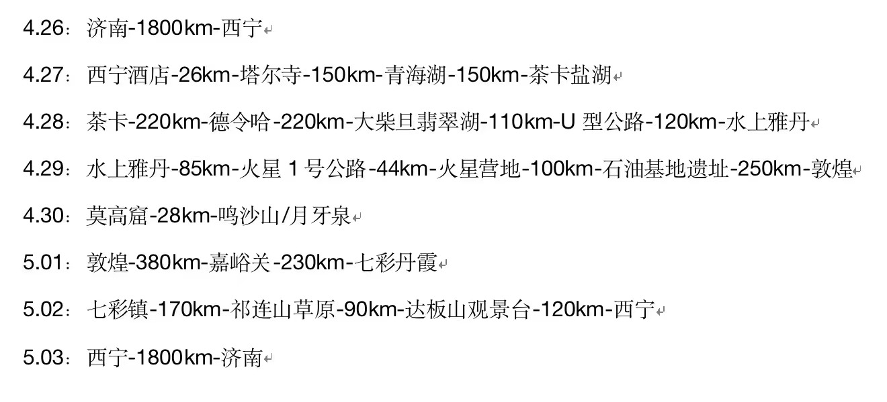
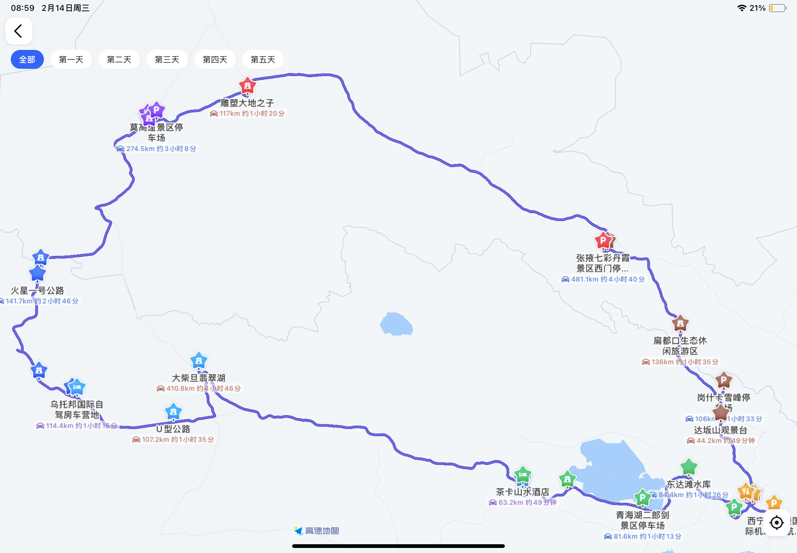
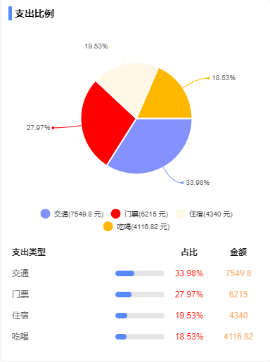
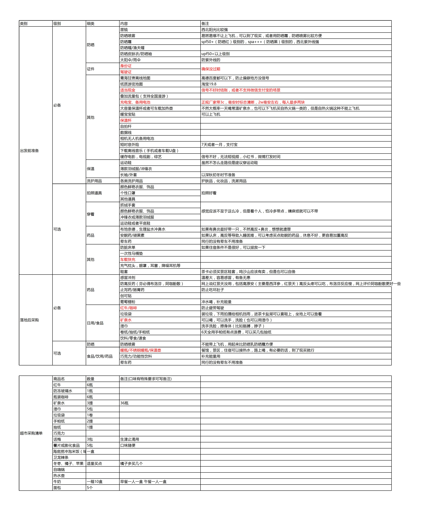

#! https://zhuanlan.zhihu.com/p/627700124

# 五一自驾游之2600KM青甘大环线（准备篇）

原定去年十一的大环线因为YQ原因，改成南下安徽行。念念不忘，必有回响。年后因政策放开，又与朋友攒局，准备重启未竟之旅。
攒局，摇人，攻略，订票，酒店，意外的顺利。

## 行程

[Day 0 准备篇](https://zhuanlan.zhihu.com/p/627700124)

[Day 1 济南直飞西宁 -> 尕张娃烤肉 -> 酒店 -> 莫家街 -> 马忠食府](https://zhuanlan.zhihu.com/p/631263216)

[Day 2 西宁酒店 -> 塔尔寺 -> 青海湖 -> 茶卡镇酒店](https://zhuanlan.zhihu.com/p/632612968)

[Day 3 茶卡盐湖 -> 大柴旦翡翠湖 -> G315国道  -> 乌托邦自驾房车营地](https://zhuanlan.zhihu.com/p/632613038)

[Day 4 乌素特水上雅丹 -> 西台吉乃尔湖 -> 火星1号公路 -> 石油遗址 -> 敦煌民宿](https://zhuanlan.zhihu.com/p/632613091)

[Day 5 民宿 -> 莫高窟 -> 鸣沙山 -> 城边边烧烤 -> 民宿](https://zhuanlan.zhihu.com/p/632613131)

[Day 6 敦煌民宿 -> 瓜州大地之子 -> 七彩丹霞 -> 酒店](https://zhuanlan.zhihu.com/p/632613160)

[Day 7 酒店 -> 扁都口 -> 祁连山草原 -> 岗什卡雪峰 -> 达坂山观景台 -> 西宁酒店](https://zhuanlan.zhihu.com/p/632613221)

[Day 8 西宁酒店 -> 济南](https://zhuanlan.zhihu.com/p/632613281)

## 环线一览

## 攒局

找到合适靠谱的旅行搭子是完美旅途的第一步，大家性格都超好且互补，如果这次旅途打分100分的话，起码70分是打给大家 8 天相处融洽。

有负责输出欧气，砍价能手，vocal担当，无人区女王的 Z 女士。

有负责美食攻略，人像摄影担当，气氛担当，山路女王的 N 女士。

有负责美食攻略，司机担当，夸夸能手，充当生理闹钟的 W 先生。

有规划行程，掌管财务，地理课代表，老司机担当 X 女士（我爱人）。

我负责开车 + 风光摄影 + 后期游记。

## 费用汇总

5 人 8 天差不多人均 6000 - 6400

提前一月多租的 2021 款 GL8（7 座 MPV ）, 5 人 + 行李会比较舒适些，考虑组队出行且全程2600KM + ，车损保险一类买的高配（含轮胎，玻璃，剐蹭等车损3W内免赔） ，相当于 778 / 天 。

短期意外险 8天54元/人 ，支持自驾意外伤害，意外医疗补偿，高风险运动意外（比如骑马，热气球啥的），旅行期间因个人责任导致赔偿三方等。

住宿因为是提前订的，价格还可以，只有乌托邦自驾房车营地略贵，整体算下来，人均不到 110 元/晚。

## 出行前准备

1. 提前预定住宿和租车
2. 提前订票（莫高窟提前一月放票），如果没有约上，只能买应急票，应急票能看的有限
3. 提前准备好随身携带物品清单和落地采购的补给清单
4. 提前了解民航随身携带或托运物品清单（比如雨伞，三脚架，充电宝，相机无人机电池等）
5. 提前研究各种攻略(小红书，抖音，B站，马蜂窝等），比如美食攻略，景点攻略，拍照攻略等
6. 提前查询目的地天气
7. 提前值机选座（根据航司和型号查询最佳座位）
8. 提前下载离线地图包，缓存离线音乐，缓存剧，西北挺多地方没有信号的。
9. 提前用高德规划路线，每篇开头的每日行程就是用高德制作的（不会的可以小红书搜）

## 器材

1. 无人机 Dji mini3 pro + 2块长续航电池
2. 两部 微单 Sony α6400 + 两颗套头 + 一颗腾龙18-300 + 4块备用电池
3. 三部安卓手机+三部苹果手机
4. 两个三脚架
5. 五个拇指灯（光绘）+ 口袋LED灯（补光+照明）
6. 3个88vip 账号免费开通夸克云盘，用于共享传输备份照片和视频

## 必备物品和落地采购清单

下一篇 [Day 1 济南直飞西宁 -> 尕张娃烤肉 -> 酒店 -> 莫家街 -> 马忠食府](https://zhuanlan.zhihu.com/p/631263216)